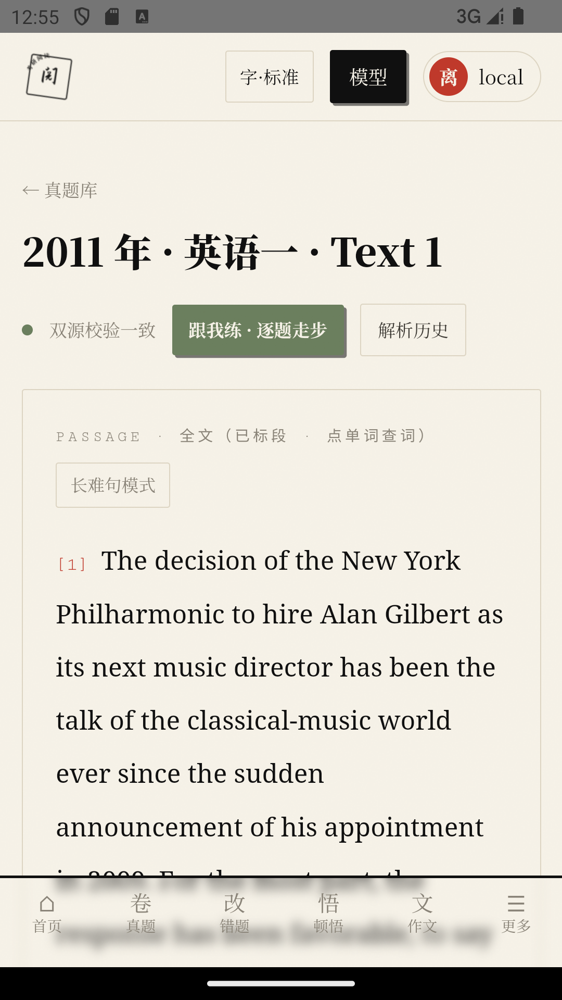
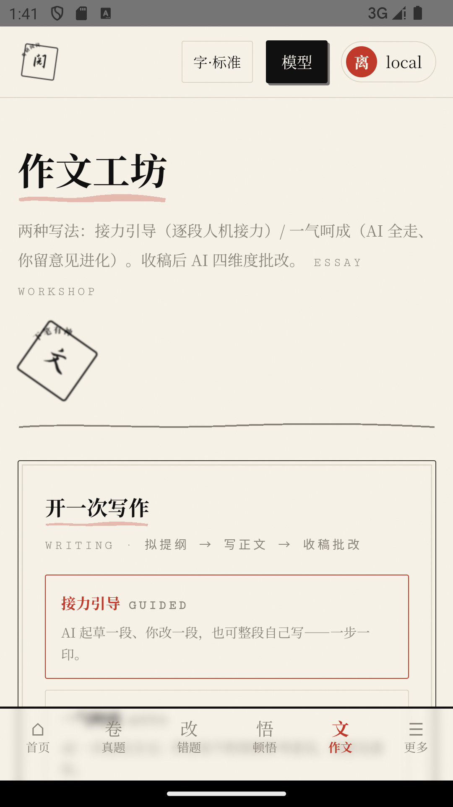
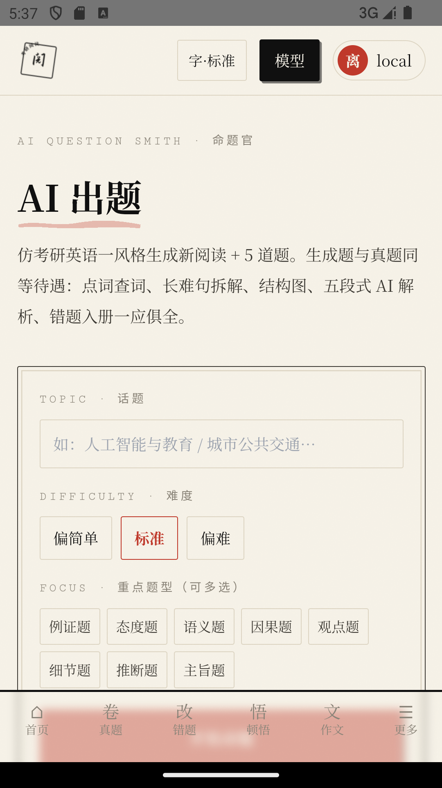

# Postgraduate Reading Assistant (纸上功夫 / Paper Kung Fu)

> Chinese version: [README.md](README.md)

A full-stack app that helps Chinese postgraduate entrance-exam (考研) candidates practice **traditional English reading comprehension** with the "SOP Six-Stage Method": official-answer-first grading, a six-stage solving pipeline, a mistake-tracking loop, AI-generated passages, and an essay workshop. Ink-wash classical UI, single-process one-command deployment.

<div align="center">

[](https://github.com/XDHRY/kaoyan-reading-app/actions/workflows/ci.yml)
[](LICENSE)
[](https://github.com/XDHRY/kaoyan-reading-app/releases)
[](CONTRIBUTING.md)

</div>

- Version: v5.12.5 (see [CHANGELOG.md](CHANGELOG.md))
- Stack: React 19 + Vite + Tailwind (frontend) · Hono + tRPC 11 + Drizzle ORM + MySQL/TiDB (backend)
- Delivery: Full-stack web service · Offline Android APK · Windows desktop (Electron)

> Note: the in-depth docs under `docs/` are written in Chinese. English coverage here focuses on the README level; translate-on-demand is welcome via issues/PRs.

## Screenshots

| Launch · ink-wash UI | Passage reading | Essay workshop | AI generation |
|---|---|---|---|
|  |  |  |  |

> Captured on the Android emulator (v5.12.x acceptance runs).

## Feature Overview

| Module | What it does |
|--------|--------------|
| Real Exam Practice | Answer real exam passages one by one; graded by official answers first (AI fallback with a label when no official answer exists) |
| Six-Stage Analysis | Comprehend → Locate → Solve → Verify → Explain → Archive; pause/resume/stop/retry-from-checkpoint throughout, 25-minute total limit + stale-task auto-detection |
| Long-Sentence Decomposition | Click a sentence to expand an in-place panel with "skeleton + meaning-cluster · exam-room reading" breakdown, without losing your reading position |
| Mind-Map Images | Optional full-passage imagery map / core-vocabulary chain map (decoupled from grading) |
| Guided Practice (跟我练) | Step-by-step participatory solving (locate first, then solve, check answers per question) |
| Mistake Book | Six-category mistake analysis + AI diagnosis insight + practice suggestions + redo / mark-as-mastered |
| Vocabulary Book | Tap words while reading to add them, with definitions, familiarity levels, and word images |
| AI-Generated Passages | Generate mock passages by topic/difficulty; history kept; compose custom review papers |
| Essay Workshop | Relay-guided / one-shot dual modes + evolve paragraph-by-paragraph per feedback + personal material library |
| Statistics | Practice count / accuracy / last 7 days / question-type distribution, split between real exam and AI passages |
| Channel Hub | Multi-channel multi-model binding (personal override > global binding > default fallback), route-map tracing, connectivity self-check |
| Immersive / Dark Mode | `⛶` immersive-mode shortcut, one-click dark mode |
| Feedback & Tickets | Site-wide feedback widget (screenshot + frontend error) → full ticket flow → announcement center |
| Admin Console | User management, global channels, global settings, SOP terms, ticket replies, announcements |
| Data Export | One-click full JSON backup export; import & restore supported |

Full usage guide: [docs/使用手册.md](docs/使用手册.md) (Chinese).

## Three Ways to Use (pick one)

**One core codebase, three delivery forms.** All three share the same features (real exams / six-stage analysis / mistakes / vocab / essays / AI generation / stats); they differ only in **runtime environment** and **data storage**:

| Form | For whom | Data storage | How to start |
|---|---|---|---|
| **Web service** | Developers / self-hosting | External MySQL (or TiDB) | `npm run build && node dist/boot.js` |
| **Windows desktop (EXE)** | Regular desktop users | Bundled MySQL (auto-started, zero config) | Download EXE, double-click |
| **Android offline (APK)** | Mobile users | Bundled SQLite offline DB (no server) | Install APK, done |

> **AI features**: all three forms support AI (analysis / essays / generation / images) after configuring an API channel. Public builds require you to fill in your own channel under "Settings → Models"; private builds embed the author's channels (local distribution only).

### Option 1: Web service (single process, self-hosted)

```bash
# Prerequisites: Node.js ≥ 20, MySQL 8+ (UTC timezone!)
cp .env.example .env   # fill in DATABASE_URL, APP_ID, APP_SECRET, ADMIN_PASSWORD
npm ci
npm run build          # frontend vite build + backend esbuild → dist/boot.js
NODE_ENV=production node dist/boot.js   # single process: static site + tRPC + bootstrap migrations
```

Open `http://localhost:3000`. First startup automatically: create tables (idempotent migrations) → seed data (SOP terms / real-exam corpus) → admin account (overridable via `ADMIN_PASSWORD`, otherwise a random password is printed once).

> Database & timezone details: [docs/部署指南.md](docs/部署指南.md) (Chinese).

### Option 2: Windows desktop (EXE)

Download `kaoyan-5.12.5-win.exe` (portable) or `kaoyan-5.12.5-setup.exe` (installer) from [Releases](https://github.com/XDHRY/kaoyan-reading-app/releases):

1. Double-click — first run auto-starts the **bundled MySQL** (requires MySQL 8 installed, or point `KYSOP_MYSQL_BIN` to mysqld.exe)
2. A local browser page opens with the same features as the web version
3. Configure AI channels under "Settings → Models" (public build requires your own keys)

### Option 3: Android offline (APK)

Download `kaoyan-5.12.5-android.apk` from [Releases](https://github.com/XDHRY/kaoyan-reading-app/releases):

1. Install and use — **no server, no network needed** (bundled SQLite offline DB with the full exam corpus)
2. All local features work; AI features need network + a configured channel ("Settings → Models")
3. Screenshot walkthrough of every feature: [docs/功能导览.md](docs/功能导览.md) (captured on the APK)

## Docs Index

| Document | Audience | Contents |
|----------|----------|----------|
| [docs/使用手册.md](docs/使用手册.md) | Users | Sign up/login → real-exam practice → six-stage analysis → mistakes/vocab/AI passages/essays/stats → settings & FAQ |
| [docs/功能导览.md](docs/功能导览.md) | Everyone | **Screenshot walkthrough of every feature** (captured on the APK, bilingual-friendly) |
| [docs/API 概览.md](docs/API 概览.md) | Developers/Integration | All tRPC endpoints (public 14 / private 98 / admin 15) + zod boundary table + authorization & isolation |
| [docs/架构说明.md](docs/架构说明.md) | Developers | Request flow / database / pipeline / channel hub / security design |
| [docs/开发指南.md](docs/开发指南.md) | Developers | Environment setup, build & migration, methodology (PonyTAIL), commit conventions, version rollback |
| [docs/测试指南.md](docs/测试指南.md) | Developers | Test suites, run commands, coverage matrix, assertion conventions, rate-limit gotchas |
| [docs/部署指南.md](docs/部署指南.md) | Ops | Production deployment (Docker / process / timezone / env vars) |
| [AGENTS.md](AGENTS.md) | AI/newcomers | Project conventions quick reference (redlines / layout / methodology) |
| [CHANGELOG.md](CHANGELOG.md) | Everyone | Version history (each version maps to an acceptance record in `verifier/runs/`) |

## Project Structure (follow this when extending)

```
contracts/          Shared frontend/backend contracts: constants (question types / six mistake categories), types, errors
db/                 schema.ts (all table definitions) → drizzle-kit generate → migrations/ (applied idempotently)
api/                Backend (Hono + tRPC)
  router.ts         Master router: one *Router.ts per domain; register new modules with one line here
  middleware.ts     publicQuery / privateQuery / adminQuery three-level guards
  context.ts        Request context (session → user)
  lib/              Cross-cutting: bootstrap (migrations + seed), rate (rate limiting), auth, http, pipelineRunner
  llm/client.ts     Channel hub: picks model per binding; keys live server-side only (DB/env)
src/                Frontend
  pages/            One page per file; routes registered in App.tsx
  components/ink/   Design system: decor (BrushTitle/PaperCard/InkDivider), Seal — new pages must use only this
  components/        Layout & feature components (FeedbackFab site-wide feedback, ProfileGate, OnboardingTour…)
  components/analysis/  Analysis view family (five-part analysis / structure diagram / diff analysis / RetroCard)
  hooks/            useUser/useToast/useSound/useShortcuts…
  lib/              errorLog (global error capture → attaches to tickets), safeStorage, analysisTypes
public/art|sounds   AI-generated ink-wash assets & sound effects
verifier/           Acceptance criteria (v1…vN/CRITERIA.md) + run records (runs/); append-only, never overwrite
docs/               This documentation system
```

## Standard Steps to Add a New Module (six steps)

1. Add tables to `db/schema.ts` → `npx drizzle-kit generate --name xxx` (applied idempotently at startup; old deployments self-heal)
2. Write `api/xxxRouter.ts` with the three-level guards; register one line in `router.ts`; shared cross-cutting code goes in `api/lib/`
3. Build `src/pages/XxxPage.tsx` with the `components/ink` design system; wire routes/navigation in `App.tsx` + `Layout.tsx`
4. Put contracts (enums/constants) in `contracts/`, shared by frontend & backend — no hardcoding on either side
5. Append assertions to the test suite (see [docs/测试指南.md](docs/测试指南.md)); done only when all green
6. Write acceptance criteria in `verifier/vN/CRITERIA.md`; record this round's result in `runs/`

## Design Redlines (consensus across iterations)

- **Add-only, never rewrite**: new features reuse existing carriers (e.g., custom papers reuse `generatedSets`); never touch existing grading paths
- The single grading authority is the official answer (`officialOf`); AI answers are downgraded reference only
- Keys are stored server-side only (DB/env); frontend only ever sees masked values; passwords stored as scrypt salted hashes; channel baseUrls forced https and block internal networks (SSRF — 22 variants verified)
- Three-level auth guards: anything writing to the DB or using compute is `private`; userId comes from session (IDOR protection)
- Real-exam corpus is for personal study only, not for public redistribution; `.env` is never packaged
- Task lifecycle: stale-task sweep + heartbeat + 25-minute total limit + checkpoint resume
- Classical-style contract: 7 CSS variables, `rounded-[2px]`, no icon library, Seal/BrushTitle/meta-label micro-copy
- **Methodology**: PonyTAIL lazy ladder (YAGNI → reuse → stdlib → minimal code), see [docs/开发指南.md](docs/开发指南.md)

## Testing

Suite scripts are committed (`verifier/v1/`) and run against a local service on port 3000; boundary suites do not trigger real LLM calls and can be run in full anytime:

```bash
cd verifier/v1
PYTHONUTF8=1 PYTHONIOENCODING=utf-8 python test_v5_api.py       # core API regression, 76 items
PYTHONUTF8=1 PYTHONIOENCODING=utf-8 python test_boundary_v6.py  # boundary sprint, 137 items (auth matrix/zod/SSRF/concurrency/isolation)
PYTHONUTF8=1 PYTHONIOENCODING=utf-8 python verify_extra.py      # supplementary acceptance, 40 items
```

Gates: `npm run check` (tsc) + `npm run lint` (eslint) + `npm run build` — all three must pass. LLM-dependent cases need real channel keys configured first; frontend smoke (`smoke_v5.py`) needs Playwright. Full details: [docs/测试指南.md](docs/测试指南.md); historical acceptance records in `verifier/runs/`.

## Full Database Snapshot

`db/dump.tar.gz` is the full database snapshot shipped with this repo (30 tables, 2763 rows of content data, incl. AI-generated images; `__drizzle_migrations` is managed by bootstrap migrations itself and is not in the snapshot). Channel API keys and account passwords are redacted (`sk-REDACTED-*` placeholders) — reconfigure them in your own environment.

```bash
cp .env.example .env           # fill DATABASE_URL (empty DB)
npm ci && npm run build
NODE_ENV=production node dist/boot.js   # first start auto-creates tables (idempotent; Ctrl+C after service is up is fine)
tar -xzf db/dump.tar.gz                 # extracts db/dump_parts/ shards
node scripts_restore_dump.mjs           # imports full data (append mode; run against an empty DB; ISO times auto-converted to MySQL format)
```

## Versions & Rollback

- Version history: CHANGELOG.md; each version maps to an acceptance record in `verifier/runs/`.
- Rollback: `git checkout v5.10.0` (or any commit SHA), see [docs/开发指南.md](docs/开发指南.md) §6.

## Data & Copyright Notice

- **Exam corpus**: the real-exam passages and question bank in this repo are **for personal study/research only**. Any commercial use or redistribution is prohibited; copyright of the exam materials belongs to their original owners.
- **Database snapshot** (`db/dump.tar.gz`): contains sanitized demo data (credentials redacted, channel keys as `sk-REDACTED-*` placeholders) for demonstration and development testing only — **no real user privacy data**.
- **Channel keys**: API keys are never shipped with the code, images, or standard APK builds; configure your own under "Settings → Channel Management" after deployment.
- Code is licensed under [LICENSE](LICENSE) (MIT); **data & corpus are NOT covered by the code license** and are subject to the terms above.
