# 功能导览（图文版）

> 本文用**真实界面截图**带你走一遍「纸上功夫」的每个功能。截图来自 Android 模拟器实测（v5.12.5 离线版）。
> 三端（Web / EXE / APK）共享同一套界面与功能，本文以 APK 截图为例，其余两端操作一致。
> 想了解三端区别与安装方式，见 [README.md](../README.md)「交付物」一节。

---

## 目录

1. [启动与首页](#1-启动与首页)
2. [真题库：选年份、选篇目](#2-真题库选年份选篇目)
3. [文章精读：查词 · 长难句](#3-文章精读查词--长难句)
4. [跟我练：六步解题法](#4-跟我练六步解题法)
5. [五段式 AI 解析](#5-五段式-ai-解析)
6. [错题本：错题闭环](#6-错题本错题闭环)
7. [顿悟室：诊断与复盘](#7-顿悟室诊断与复盘)
8. [生词本：查词即收藏](#8-生词本查词即收藏)
9. [作文工坊：人机接力写作](#9-作文工坊人机接力写作)
10. [AI 出题：模拟新题](#10-ai-出题模拟新题)
11. [学习统计：功课单](#11-学习统计功课单)
12. [设置中心：渠道 · 外观 · 备份](#12-设置中心渠道--外观--备份)
13. [全部去处：功能总览](#13-全部去处功能总览)

---

## 1. 启动与首页

打开 App 先加载离线题库，随后进入水墨古风首页：顶部「纸上功夫」品牌 Banner + 学习统计卡（已练篇章 / 正确率 / 待攻克错题 / 连续学习），下方是「做题六步图谱」引导。

| 启动加载 | 首页 |
|---|---|
|  | 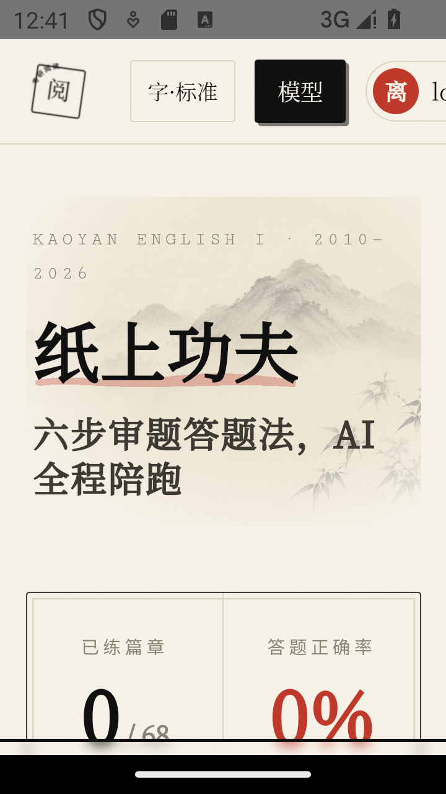 |

首页统计卡展示学习进度总览；「继续学习」卡片引导你从最新一年真题开始；底部导航（首页 / 真题 / 错题 / 顿悟 / 作文 / 更多）直达各功能模块。

## 2. 真题库：选年份、选篇目

底部导航点「卷 真题」进入真题库：年份筛选（全部 / 2010–2026），选择年份后下方列出该年 4 篇传统阅读（Text 1–4），每篇标注段落数与题数。

| 真题库 · 年份筛选 | 2020 年文章列表 |
|---|---|
| 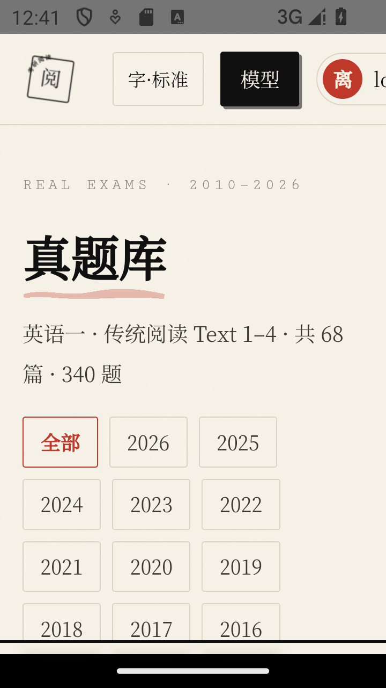 | 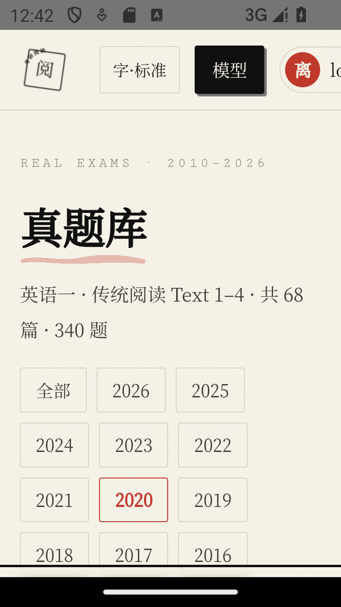 |

## 3. 文章精读：查词 · 长难句

点「开始练习」进入文章精读页：全文已标段，**点任意单词即查词**（自动收入生词本）；「长难句模式」原位展开句子主干拆解；顶部「跟我练·逐题走步」进入交互式解题。

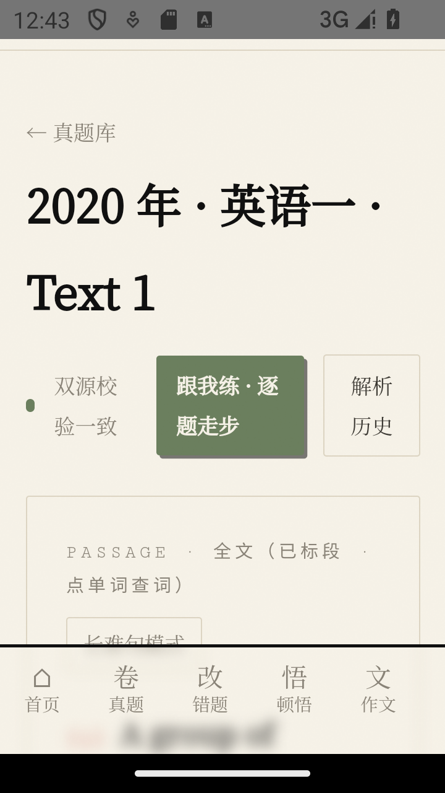

## 4. 跟我练：六步解题法

「跟我练」是六步审题答题法的交互载体：**每一步你先作答，再看 AI 参照**。流程为「壹 审题 → 贰 定位 → 叁 解题 → 肆 复盘」，题号 1–5 逐题推进，参照全部来自本篇深度解析，零等待。

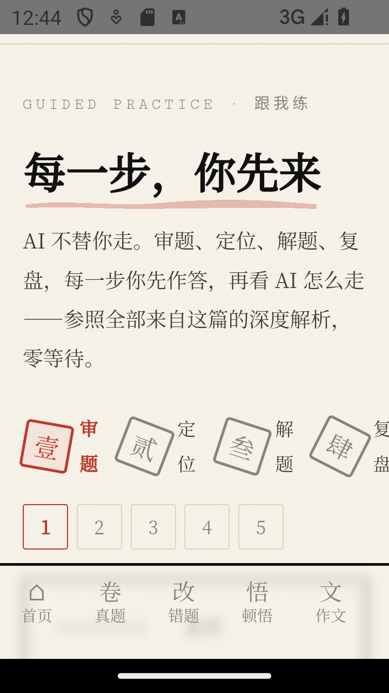

> 审题步骤会先让你判断题型（例证/态度/语义/因果/观点/细节/推断/主旨），提交后再看 AI 的题型判断与考点分析。

## 5. 五段式 AI 解析

完整解析以**后台任务**方式运行，流水线为「结构 → 审题 → 定位 → 解题+校验 → 交叉验证」，全程可暂停 / 继续 / 停止，25 分钟总时限 + 断点续跑。

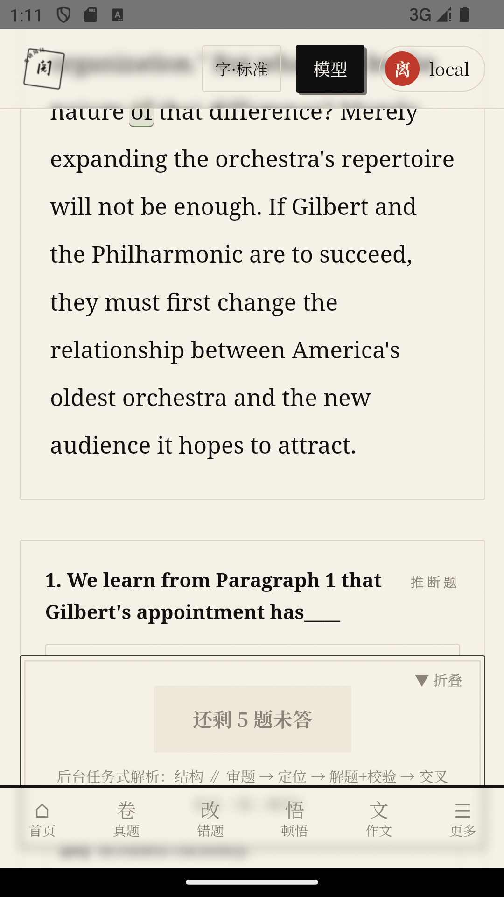

## 6. 错题本：错题闭环

练习中做错的题**自动入册**。按错因六分法分类（待攻克 / 已掌握），重练做对即盖「已掌握」印——错题不过夜。每道错题可生成 AI 诊断书与练习建议。

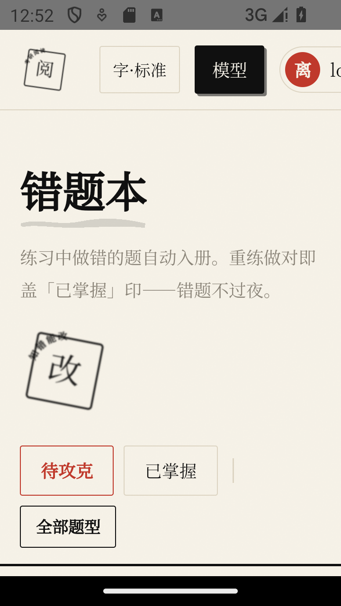

## 7. 顿悟室：诊断与复盘

错因六分法诊断 · AI 备考参谋 · 感悟沉淀 · 艾宾浩斯抗遗忘。功能：备考建议（AI 生成个性化复习方案）、感悟笔记、错因概收、复盘打卡。

## 8. 生词本：查词即收藏

阅读时点单词自动收入。点卡片翻面看释义（含词性 + 考研语境），按熟悉度归档（生 / 熟 / 会了），可生成词汇记忆配图。

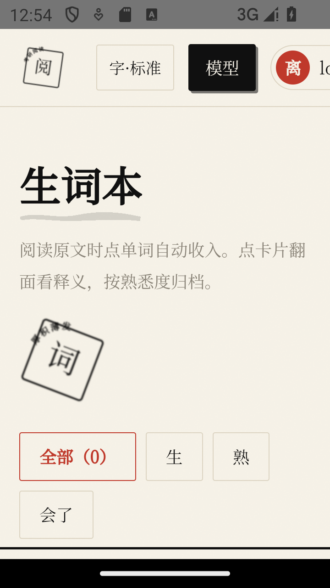

## 9. 作文工坊：人机接力写作

两种写作模式：**接力引导**（逐段人机接力）与**一气呵成**（AI 全走、你留意见进化）。收稿后 AI 四维度批改（结构 / 内容 / 语言 / 逻辑），按批改意见逐段进化。

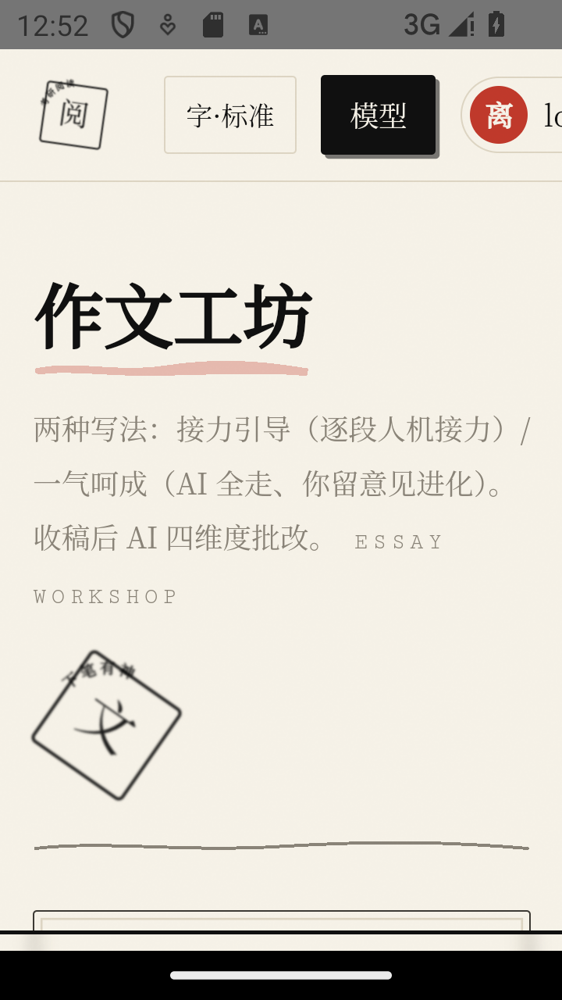

## 10. AI 出题：模拟新题

仿考研英语一风格生成新阅读 + 5 道题。生成题与真题**同等待遇**：点词查词、长难句拆解、结构图、五段式 AI 解析、错题入册一应俱全。可编复盘定制卷。

## 11. 学习统计：功课单

「local 的功课单：练了才知道深浅。」展示已练篇章 / 总正确率 / 近 7 天趋势 / 题型分布，真题与 AI 生题分源统计。

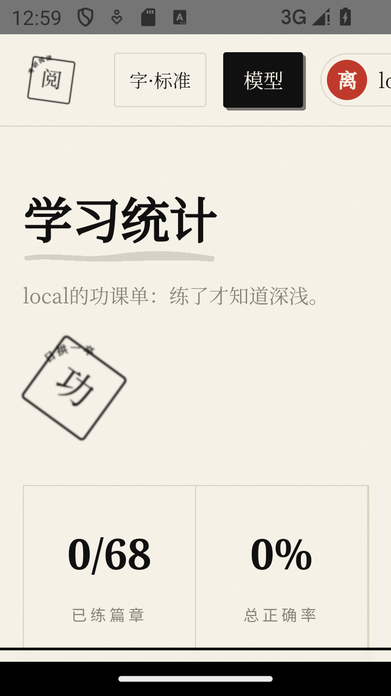

## 12. 设置中心：渠道 · 外观 · 备份

- **模型渠道**：新增任意 OpenAI / Anthropic 协议节点，节点永久入库；Key 只存服务端，前端仅显示掩码。顶栏「模型」按钮可随时快捷管理。
- **外观与数据**：浅色 / 跟随系统 / 宣纸浅 / 松烟深（夜读不伤眼）、动作音效开关、沉浸阅读快捷键。
- **数据备份**：一键导出全量 JSON（练习记录 / 错题与诊断书 / 感悟 / 生词 / AI 仿真题 / 作文），可导入恢复。

## 13. 全部去处：功能总览

底部「更多」收纳全部功能入口：仪表盘 / SOP 图谱 / 真题库 / 错题本 / 顿悟室 / 生词本 / 作文工坊 / 统计 / 档案 / AI 出题 / 指南 / 手册 / 管理 / 工单 / 设置。

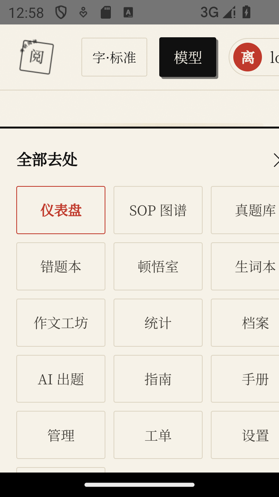

---

## 版权与数据声明

- 截图均为应用内真实界面，真题语料仅供个人学习研究使用（详见 [README](../README.md)「数据与版权声明」）。
- 截图来自公共版 / 私有版均可显示的功能界面；私有版节点为作者本地配置，不随发布物分发。
